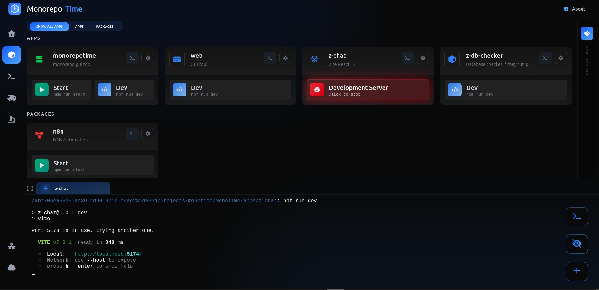
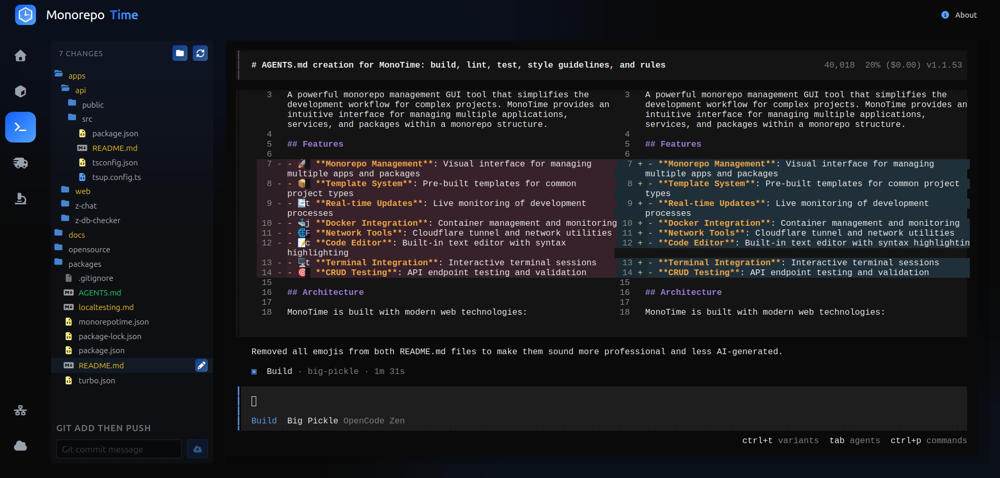
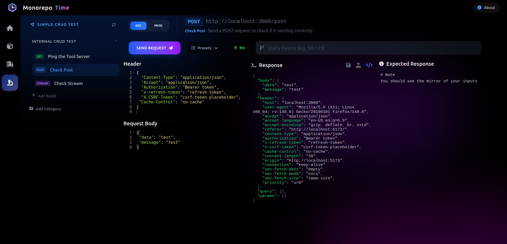

# MonoTime

A powerful monorepo management GUI tool that simplifies the development workflow for complex projects. MonoTime provides an intuitive interface for managing multiple applications, services, and packages within a monorepo structure.

## Features

- **Monorepo Management**: Visual interface for managing multiple apps and packages
- **Template System**: Pre-built templates for common project types
- **Real-time Updates**: Live monitoring of development processes
- **Docker Integration**: Container management and monitoring
- **Network Tools**: Cloudflare tunnel and network utilities
- **Code Editor**: Built-in text editor with syntax highlighting
- **Terminal Integration**: Interactive terminal sessions
- **CRUD Testing**: API endpoint testing and validation

## Architecture

MonoTime is built with modern web technologies:

- **Frontend**: Vite + React + TypeScript + Tailwind CSS + Radix UI
- **Backend**: Express + TypeScript + Socket.IO
- **Build System**: Turborepo for monorepo orchestration
- **Package Manager**: npm with workspaces

## Project Structure

```
MonoTime/
├── apps/
│   ├── web/          # Frontend React application
│   ├── api/          # Backend Express server (CLI tool)
│   └── */            # Other applications
├── packages/
│   ├── types/        # Shared TypeScript interfaces
│   ├── config/       # Configuration constants
│   ├── template/     # Project templates
│   ├── api/          # API route definitions
│   └── */            # Other packages
└── docs/             # Documentation and images
```

## Getting Started

### Prerequisites

- Node.js 18+ 
- npm 7+

### Installation

1. Clone the repository:
   ```bash
   git clone <repository-url>
   cd MonoTime
   ```

2. Install dependencies:
   ```bash
   npm install
   ```

3. Start development servers:
   ```bash
   npx turbo dev
   ```
   This will start both the frontend and backend in watch mode:
   - Frontend: http://localhost:5173
   - Backend: http://localhost:4793

### Development Commands

```bash
# Install dependencies across all packages
npm install

# Start development servers
npx turbo dev

# Build all packages
npx turbo build

# Run linting
npx turbo lint

# Clean build artifacts
npx turbo clean
```

### Individual Package Commands

#### Frontend (apps/web)
```bash
cd apps/web
npm run dev      # Start development server
npm run build    # Build for production
npm run lint     # Run linter
npm run preview  # Preview production build
```

#### Backend (apps/api)
```bash
cd apps/api
npm run dev      # Start development server
npm run build    # Build for distribution
npm start        # Start production server
npm run stop     # Stop running server
```

## Usage

MonoTime provides a comprehensive GUI for managing your monorepo:

1. **Dashboard**: Overview of all projects and their status
2. **Workspace**: Manage individual workspaces and their configurations
3. **OpenCode**: Integrated development environment with terminal access
4. **Turborepo**: Turborepo-specific management and monitoring
5. **CRUD Tester**: Test API endpoints and validate responses
6. **Network & Docker**: Container management and network utilities
7. **Cloudflare Tunnel**: Manage tunnel configurations

## Distribution

MonoTime is distributed as an npm package. To build and publish:

1. Build the project:
   ```bash
   npx turbo build
   ```

2. The build process automatically:
   - Compiles the frontend to `apps/web/dist`
   - Copies frontend assets to `apps/api/public`
   - Builds the backend to `apps/api/dist`

3. Publish from the `apps/api` directory:
   ```bash
   cd apps/api
   npm publish
   ```

## CLI Usage

After installation, you can use MonoTime as a CLI tool:

```bash
# Start the GUI
monorepotime

# Show version
monorepotime -v

# Show help
monorepotime --help

# Initialize a new monorepo
monorepotime init
```

## Screenshots





## License

ISC License - see LICENSE file for details.

